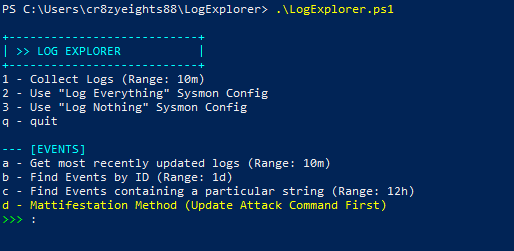
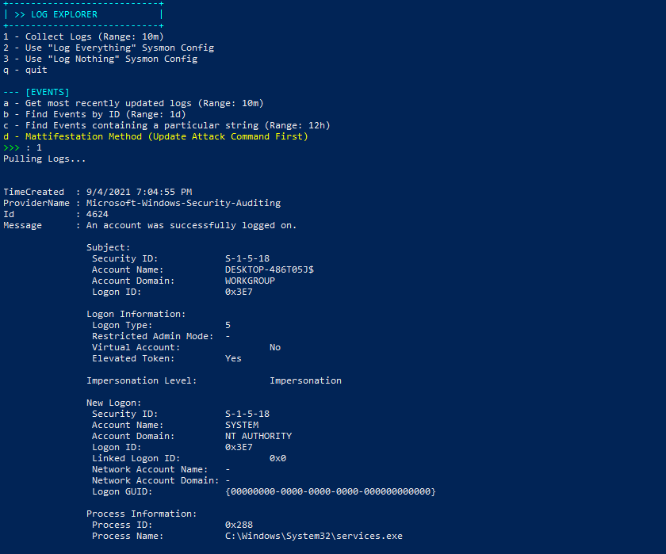
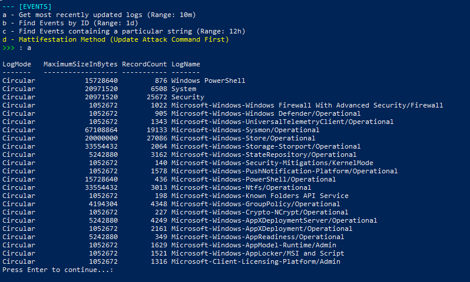
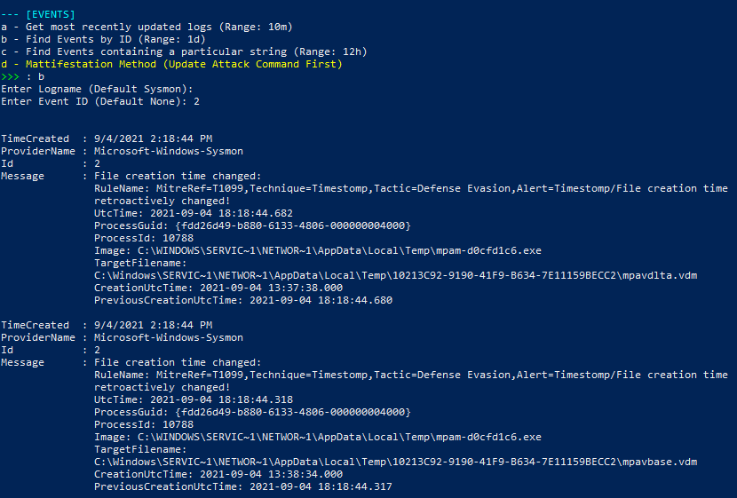
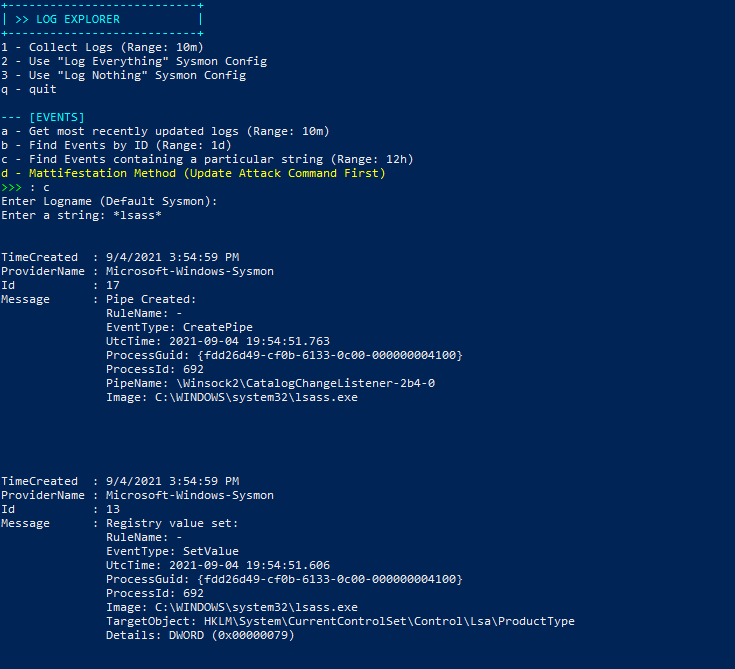
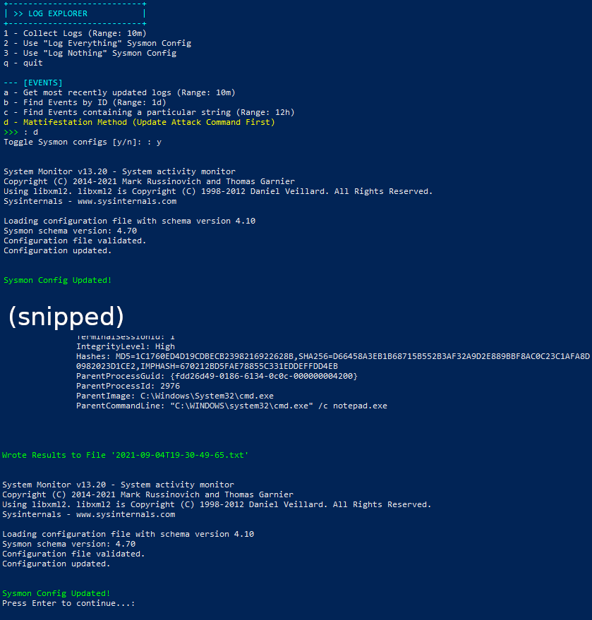
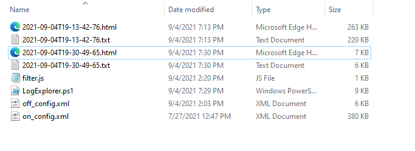
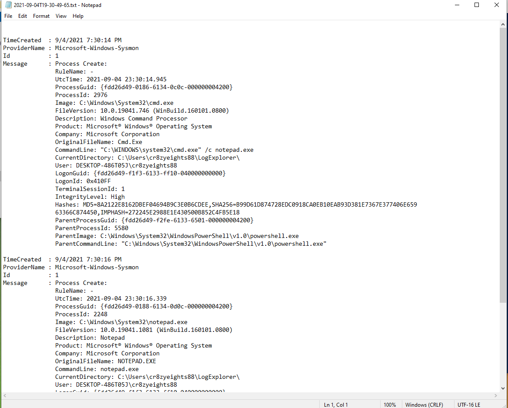
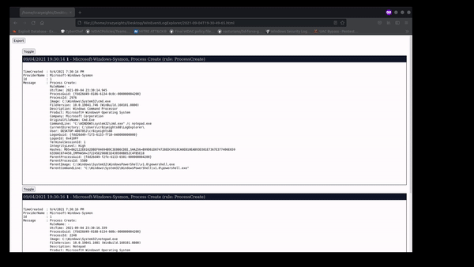

# WinEventLogExplorer

Capture all events across all logs produced during the running of a particular exploit/script. Has functionality to search and filter events. 

Nothing special but useful for collecting exploit/threat data for detection engineering, pen-testing, etc.

Follows the Matt Graeber method from his talk here:
[1 05 How do I detect technique X in Windows Applied Methodology to Definitively Answer this Question](https://www.youtube.com/watch?v=GVRIUsgrwSQ).

This is generally:

1. Understand the Implementation
2. Develop Attack Validations
	- Develop as many attack variants as possible.
		1. Identify common and/or distinct detection data sources across procedures
		2. Maximize "detection coverage"
3. Observe Detection Artifacts
	- Using process monitor, process explorer, process hacker, ...

Inspired by: 
[HowToDetectTechniqueX_Demos.ps1](https://gist.github.com/gavz/3730f8cb7be5ba400ea02cd90f05f6cb)

Can be run as Administrator or not as Administrator, although some of the event logs require Admin privileges to access, and you need Admin privileges to update the Sysmon config.

To run:
```
.\LogExplorer.ps1
```

Update the sysmon path on line 27 before using:
```
# Sysmon:
$sysmon_path = "C:\Sysinternals\SysinternalsSuite\Sysmon64.exe"		# Path to Sysmon exe
```
## How to Use:



#### Option 1 - Collect Logs

Print all events from all event logs that have been created in the past 10 minutes. Exports to a TXT file, and html.



These two options are optional.

### Option 2 - Use "Log Everything" Sysmon Config

Sets the current Sysmon config to a config that logs everything (or alot). Using the config by SwiftOnSecurity `https://github.com/SwiftOnSecurity/sysmon-config`.

Make sure to configure as desired.

See `on_config.xml`

### Option 3 - Use "Log Nothing" Sysmon Config

Sets the current Sysmon config to a config that logs nothing. See `off_config.xml`.

## Event Searching and Filtering

### Option a - Get most recently updated logs 

Get the names of the Event logs that were updated in the last 10 minutes.



### Option b - Find Events by Id

Find events by ID from a particular log.



### Option c - Find Events containing a particular string

Find events containing a particular string from a particular log.

Use the syntax `query*` to find events beginning with `query`, `*query` to find events ending in `query`, and `*query*` to find events containing `query`.

Example: Searching for events containing lsass in Sysmon log.


### Option d - Mattifestation Method

This method is to get all the events that are produced during the running of an exploit (and only those events).

You must change the attack command (line 99) to the command of the exploit/script you want to test before using it (see examples for command format)
```ps1	
# Perform Attack Here:
# ---------------------------------------------------------------------
	
# Examples (REPLACE ME):
& cmd.exe /c notepad.exe
```

It works as follows:

1. Set the current Sysmon config to the "log everything" config  (Optional)
2. Get the current time `start_time`
3. Run the exploit
4. Get the current time `end_time`
5. Get the events produced between `start_time` and `end_time`
6. Export them to a file for further analysis
7. Set the current Sysmon config to the "log nothing" config (Optional)

Example with command `cmd.exe /c notepad.exe`:


### Export Formats:

Events are exported to a TXT and HTML file, named by timestamp



#### TXT File:




### HTML File:

Toggle events to find the ones that are relevant and export to TXT file.



### Conifguration:

Change the following constants to modify the search intervals:

**You must change the sysmon path** to use the sysmon config toggle functionality.
```ps1
# CONSTANTS:
# ==================
$newest_log_writes_period = (New-TimeSpan -Minute 10) # Get the logs that were most recently updated (Get-Newest-Log-Writes)
$pull_by_id_period = (New-TimeSpan -Hour 24)		  # Get the events by id (Pull-By-ID)
$pull_by_string_period = (New-TimeSpan -Hour 12)	  # Get events containing an particular string (Search-For-String-In-Source)
$pull_all_period = (New-TimeSpan -Hour 1)			  # Get all events in a particular time period (Pull-Event-Logs)

# Sysmon:
$sysmon_path = "C:\Sysinternals\SysinternalsSuite\Sysmon64.exe"		# Path to Sysmon exe
$sysmon_on_config_location = "$PWD\on_config.xml"					# Path to "log everything" config
$sysmon_off_config_location = "$PWD\off_config.xml"					# Path to "log nothing" config

# =====================
```